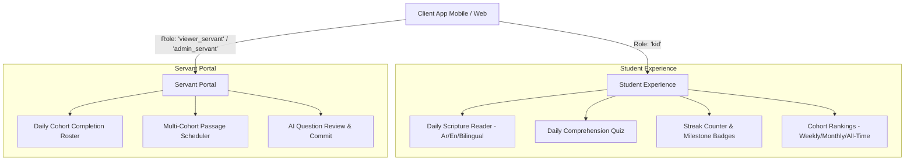

# Evangelion Frontend Integration Guide 📱💻
> Complete developer handbook for building the Evangelion Student & Servant Client Applications (Mobile / Web).

---

## 📑 Table of Contents
1. [Architecture & Target Users](#1-architecture--target-users)
2. [Global Headers & HTTP Client Setup](#2-global-headers--http-client-setup)
3. [TypeScript Data Contracts & Models](#3-typescript-data-contracts--models)
4. [Screen Specifications & User Flows](#4-screen-specifications--user-flows)
   - [Screen 1: Today's Scripture Reading & Quiz](#screen-1-todays-scripture-reading--quiz)
   - [Screen 2: Daily Streak Hub & Milestone Progress](#screen-2-daily-streak-hub--milestone-progress)
   - [Screen 3: Cohort Leaderboard](#screen-3-cohort-leaderboard)
   - [Screen 4: Scripture Reader (Bible Browser)](#screen-4-scripture-reader-bible-browser)
   - [Screen 5: Servant & Admin Dashboard](#screen-5-servant--admin-dashboard)
5. [Typography, RTL & Arabic Diacritics (Crucial)](#5-typography-rtl--arabic-diacritics-crucial)
6. [Error Handling & Edge Cases](#6-error-handling--edge-cases)
7. [Postman & Offline Mocking](#7-postman--offline-mocking)

---

## 1. Architecture & Target Users

The backend is built with **Fastify 5**, **PostgreSQL**, **Redis**, and **Google Gemini AI**. The client application interfaces with two primary roles:



### The 7 Sunday School Cohorts
Every student belongs to one of these groups (passed via `X-Group-Id`):
| `group_id` | Cohort Name | Target Grades | Gender |
| :---: | :--- | :---: | :---: |
| **1** | Grade 3 & 4 Boys | Grades 3–4 | `boys` |
| **2** | Grade 3 & 4 Girls | Grades 3–4 | `girls` |
| **3** | Grade 5 & 6 Boys | Grades 5–6 | `boys` |
| **4** | Grade 5 & 6 Girls | Grades 5–6 | `girls` |
| **5** | Grade 6, 7 & 8 Boys | Grades 6–8 | `boys` |
| **6** | Grade 6, 7 & 8 Girls | Grades 6–8 | `girls` |
| **7** | Grade 10, 11 & 12 Mixed | Grades 10–12 | `mixed` |

---

## 2. Global Headers & HTTP Client Setup

### 🌐 Live Public Backend Endpoint:
- **Base URL:** `https://genre-minimize-thorough-hands.trycloudflare.com` (or `http://localhost:3000` when running locally)
- **Interactive Swagger Docs:** `https://genre-minimize-thorough-hands.trycloudflare.com/docs`
- **OpenAPI JSON Spec:** `https://genre-minimize-thorough-hands.trycloudflare.com/docs/json`

Every client request must include identification headers. Configure an Axios or Fetch interceptor:

```typescript
// src/api/client.ts
import axios from 'axios';

export const apiClient = axios.create({
  baseURL: process.env.EXPO_PUBLIC_API_URL || 'https://genre-minimize-thorough-hands.trycloudflare.com',
  timeout: 10000,
});

// Attach user session headers automatically
export function setAuthHeaders(userId: string, groupId: number, role: 'kid' | 'viewer_servant' | 'admin_servant' = 'kid') {
  apiClient.defaults.headers.common['X-User-Id'] = userId;
  apiClient.defaults.headers.common['X-Group-Id'] = String(groupId);
  apiClient.defaults.headers.common['X-User-Role'] = role;
}
```

---

## 3. TypeScript Data Contracts & Models

Copy these interfaces into your frontend project (e.g. `src/types/api.ts`):

```typescript
// 1. Reading & Scripture
export interface ScriptureVerse {
  book_number: number;
  chapter: number;
  verse: number;
  text: string;
  text_clean?: string; // Diacritic-stripped Arabic (for highlighting or TTS)
}

export interface ReadingQuestion {
  id: string;
  sort_order: number;
  type: 'mcq' | 'true_false' | 'short_answer';
  prompt: string;
  options: Record<string, string> | null; // e.g. { A: "نِيقُودِيمُوسُ", B: "بُولُسُ", C: "بُطْرُسُ", D: "لِعَازَرُ" }
  points_value: number;
  already_answered: boolean;
  user_answer: string | null;
  is_correct: boolean | null;
}

export interface TodayReadingResponse {
  reading_id: string;
  group_id: number;
  scheduled_date: string;
  language: 'ar' | 'en';
  reference: string;      // e.g. "يوحنا 3: 1-5" or "John 3:1-5"
  translation: string;    // e.g. "Smith & Van Dyck (فانديك)" or "NKJV"
  verses: ScriptureVerse[];
  questions: ReadingQuestion[];
  is_fully_completed: boolean;
  total_points_earned_today: number;
  current_streak: number;
}

// 2. Daily Streak
export type TodayStreakStatus = 'completed' | 'pending' | 'off_day' | 'broken';

export interface StreakDetailsResponse {
  user_id: string;
  group_id: number;
  current_streak: number;
  longest_streak: number;
  last_completed_date: string | null;
  today_date: string;
  today_scheduled: boolean;
  today_completed: boolean;
  today_status: TodayStreakStatus;
  next_milestone: number;     // e.g. 3, 7, 14, 21, 30, 50, 100 days
  days_to_milestone: number;  // days left until next milestone
  history: Array<{
    reading_id: string;
    scheduled_date: string;
    book_number: number;
    book_name_ar: string;
    book_name_en: string;
    reference: { ar: string; en: string };
    total_questions: number;
    answered_questions: number;
    correct_answers: number;
    points_earned: number;
    is_completed: boolean;
  }>;
}

export interface StreakSummaryResponse {
  user_id: string;
  group_id: number;
  current_streak: number;
  longest_streak: number;
  last_completed_date: string | null;
  today_status: TodayStreakStatus;
  today_completed: boolean;
  today_scheduled: boolean;
  next_milestone: number;
  days_to_milestone: number;
}

// 3. Question Submission Result
export interface SubmitAnswerResult {
  question_id: string;
  is_correct: boolean;
  points_earned: number;
  current_total_points: number;
  current_streak: number;
  longest_streak: number;
  reading_completed: boolean;
}

// 4. Leaderboard
export interface LeaderboardEntry {
  userId: string;
  full_name: string;
  score: number;
  rank: number;
  current_streak: number;
}

export interface LeaderboardResponse {
  group_id: number;
  window: 'weekly' | 'monthly' | 'all_time';
  total_ranked: number;
  my_standing: { rank: number | null; score: number } | null;
  leaderboard: LeaderboardEntry[];
}
```

---

## 4. Screen Specifications & User Flows

### Screen 1: Today's Scripture Reading & Quiz

**API Endpoints:**
- `GET /api/v1/readings/today/ar` (Dedicated Arabic)
- `GET /api/v1/readings/today/en` (Dedicated English)
- `GET /api/v1/readings/today` (Parallel Bilingual)
- `POST /api/v1/readings/:id/submit` (Submit answer)

```
┌────────────────────────────────────────────────────────┐
│  [AR / EN / Both Toggle]                🔥 4 Days      │
│  📖 John 3:1-5 • Smith & Van Dyck                      │
├────────────────────────────────────────────────────────┤
│  1 كَانَ إِنْسَانٌ مِنَ الْفَرِّيسِيِّينَ اسْمُهُ...         │
│  2 هَذَا جَاءَ إِلَى يَسُوعَ لَيْلاً وَقَالَ لَهُ...         │
│  3 أَجَابَ يَسُوعُ وَقَالَ لَهُ: الْحَقَّ الْحَقَّ...       │
├────────────────────────────────────────────────────────┤
│  ❓ Question 1 of 1 (10 Points)                         │
│  مَا اسْمُ الرَّجُلِ الْفَرِّيسِيِّ الَّذِي جَاءَ؟            │
│                                                        │
│  [ (A) نِيقُودِيمُوسُ ]    [ (B) بُولُسُ ]              │
│  [ (C) بُطْرُسُ ]          [ (D) لِعَازَرُ ]            │
│                                                        │
│  [ Submit Answer Button ]                              │
└────────────────────────────────────────────────────────┘
```

#### Client Implementation Guidelines:
1. **Language Segmented Control:**
   Allow the kid to easily switch between Arabic (`/today/ar`), English (`/today/en`), and Bilingual (`/today`). Remember their preference in `AsyncStorage` / `localStorage`.
2. **Submission & Feedback:**
   - On tap `Submit`:
     ```typescript
     const res = await apiClient.post<SubmitAnswerResult>(`/api/v1/readings/${readingId}/submit`, {
       question_id: question.id,
       answer: selectedOption, // e.g. "A"
     });
     ```
   - **If `is_correct === true`:**
     - Trigger haptic success feedback (`Haptics.notificationAsync(Success)`).
     - Show **+10 Points** animation.
     - Highlight option green.
   - **If `is_correct === false`:**
     - Highlight selected option red.
     - Show correct answer.
   - **If `reading_completed === true`:**
     - Display a celebratory modal/banner: *"Daily Reading Completed! Streak +1 (🔥 Now {res.data.current_streak} Days!)"*.

---

### Screen 2: Daily Streak Hub & Milestone Progress

**API Endpoints:**
- Header / Home Widget: `GET /api/v1/streak/summary`
- Dedicated Hub Modal / Page: `GET /api/v1/streak`

```
┌────────────────────────────────────────────────────────┐
│                     🔥 5 DAYS                          │
│               Consecutive Daily Streak                 │
│                                                        │
│  [Status: Today Completed ✅]  •  Longest: 7 Days      │
├────────────────────────────────────────────────────────┤
│  Next Milestone: 7-Day Flame 🏆                        │
│  [██████████████████░░░░] 2 days remaining             │
├────────────────────────────────────────────────────────┤
│  📅 Last 7 Scheduled Days:                             │
│  • Sep 30: John 3:1-5          [ 10 pts • 1/1 ✅ ]      │
│  • Sep 29: John 2:1-11         [ 10 pts • 1/1 ✅ ]      │
│  • Sep 28: John 1:35-51        [ 10 pts • 1/1 ✅ ]      │
│  • Sep 27: (Sunday / Off-Day)  [ Streak Protected 🛡️ ] │
│  • Sep 26: John 1:1-18         [ 10 pts • 1/1 ✅ ]      │
└────────────────────────────────────────────────────────┘
```

#### How to Render `today_status`:
- **`completed`**: Green badge `Completed Today ✅`. Streak is active and counted.
- **`pending`**: Orange badge `Reading Pending ⏳`. Copy: *"Complete today's reading to keep your {current_streak}-day streak alive!"*.
- **`off_day`**: Blue shield badge `Church Off-Day 🛡️`. Copy: *"No reading scheduled today (Sunday / Church Feast). Your streak is preserved!"*.
- **`broken`**: Gray/Red badge `Streak Reset`. Copy: *"Missed yesterday's reading. Complete today to start a fresh streak!"*.

---

### Screen 3: Cohort Leaderboard

**API Endpoint:**
- `GET /api/v1/leaderboard?window=weekly|monthly|all_time`

```
┌────────────────────────────────────────────────────────┐
│  Cohort: Grade 5 & 6 Boys (Group 3)                    │
│  [ Weekly | Monthly | All-Time ]                       │
├────────────────────────────────────────────────────────┤
│  🥇 1. Peter George       80 pts   🔥 7 days           │
│  🥈 2. David Mina         50 pts   🔥 5 days           │
│  🥉 3. Mark Anton         30 pts   🔥 2 days           │
│     4. Mina Samuel        20 pts   🔥 1 day            │
├────────────────────────────────────────────────────────┤
│  📌 My Standing: Rank #2 • 50 Points                   │
└────────────────────────────────────────────────────────┘
```

#### Client Implementation Guidelines:
- Top 3 students can be highlighted with Podium cards / gold, silver, bronze medals.
- Always display the sticky bottom bar with `my_standing` (`rank` and `score`).
- Include the flame icon next to each student: `🔥 ${student.current_streak}` to encourage friendly peer motivation!

---

### Screen 4: Scripture Reader (Bible Browser)

**API Endpoints:**
- `GET /api/v1/bible/verses/ar?book_number=43&start_chapter=3&start_verse=1&end_verse=16`
- `GET /api/v1/bible/verses/en?book_number=43&start_chapter=3&start_verse=1&end_verse=16`
- `GET /api/v1/bible/verses?book_number=43&start_chapter=3&start_verse=1&end_verse=16`

Use this screen for open Bible search and passage lookups outside the daily scheduled readings.

---

### Screen 5: Servant & Admin Dashboard

**API Endpoints:**
- `GET /api/v1/servant/reports/daily?group_id=3&date=YYYY-MM-DD`
- `POST /api/v1/admin/readings/schedule`

```
┌────────────────────────────────────────────────────────┐
│  Cohort: Grade 5 & 6 Boys • Date: 2026-09-30           │
│  Completion: 8 / 12 Students (67%)                     │
├────────────────────────────────────────────────────────┤
│  Student               Status      Points  Streak      │
│  ───────────────────────────────────────────────────── │
│  David Mina            ✅ 1/1       10      🔥 5       │
│  Peter George          ✅ 1/1       10      🔥 7       │
│  Mark Anton            ⏳ 0/1        0      🔥 2       │
└────────────────────────────────────────────────────────┘
```

Servants can view at a glance which kids have read today and follow up with parents or kids who are pending before midnight.

---

## 5. Typography, RTL & Arabic Diacritics (Crucial)

> [!IMPORTANT]
> The Arabic translation is **Smith & Van Dyck**, which features full vocalization (Tashkeel). Incorrect font settings will cause diacritics to clip or overlap consecutive lines.

### Recommended CSS / Styles:
```css
/* For Arabic Scripture text */
.scripture-ar {
  direction: rtl;
  font-family: 'Amiri', 'Noto Naskh Arabic', serif;
  font-size: 22px;
  line-height: 2.2; /* CRITICAL: High line-height prevents diacritic clipping */
  text-align: right;
  letter-spacing: 0.5px;
}

/* For English Scripture text */
.scripture-en {
  direction: ltr;
  font-family: 'Georgia', 'Merriweather', serif;
  font-size: 18px;
  line-height: 1.7;
  text-align: left;
}

/* Verse number badge */
.verse-num {
  font-size: 12px;
  font-weight: 700;
  color: #c99738; /* Gold/Bronze accent */
  margin-inline-end: 6px;
  vertical-align: super;
}
```

---

## 6. Error Handling & Edge Cases

| Status Code | Scenario | Recommended UI Behavior |
| :---: | :--- | :--- |
| `400 Bad Request` | Missing headers (`X-Group-Id`, `X-User-Id`). | Redirect to profile / cohort selector. |
| `404 Not Found` | No reading scheduled for this cohort today. | Show friendly empty state: *"No reading scheduled for today. Rest and meditate on God's word!"*. |
| `409 Conflict` | Question has already been submitted. | Disable submission buttons, mark question as already answered. |
| `500 Server Error` | Backend issue or network drop. | Show retry toast button with exponential backoff. |

---

## 7. Postman & Offline Mocking

The backend includes a pre-configured Postman collection and environment:
- [`postman_collection.json`](file:///d:/Evangelion/Backend/postman_collection.json)
- [`postman_environment.json`](file:///d:/Evangelion/Backend/postman_environment.json)

You can import these into Postman to inspect exact request/response payloads before writing UI components. Additionally, the backend has an active **in-memory database fallback**, so you can run the server locally with `npm run dev` and test full API responses immediately without needing Docker or PostgreSQL installed!

---

Happy building! ✝️🕊️
